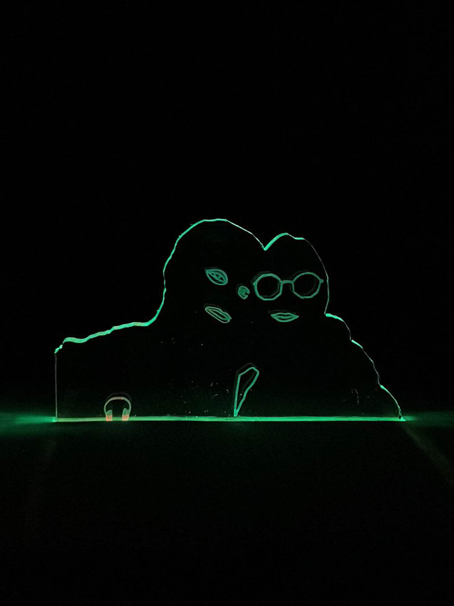
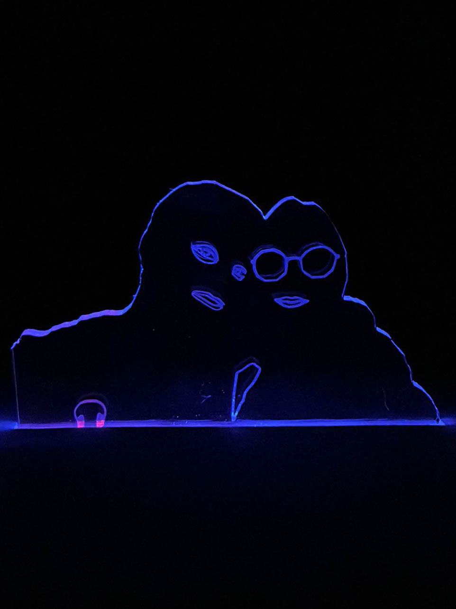
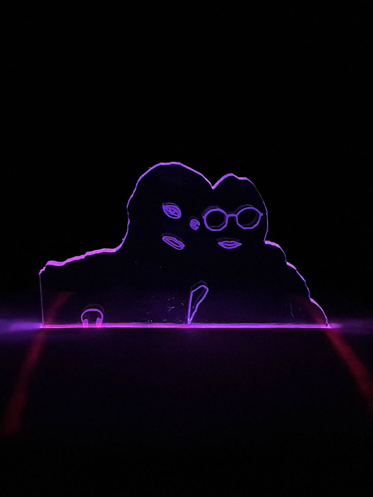
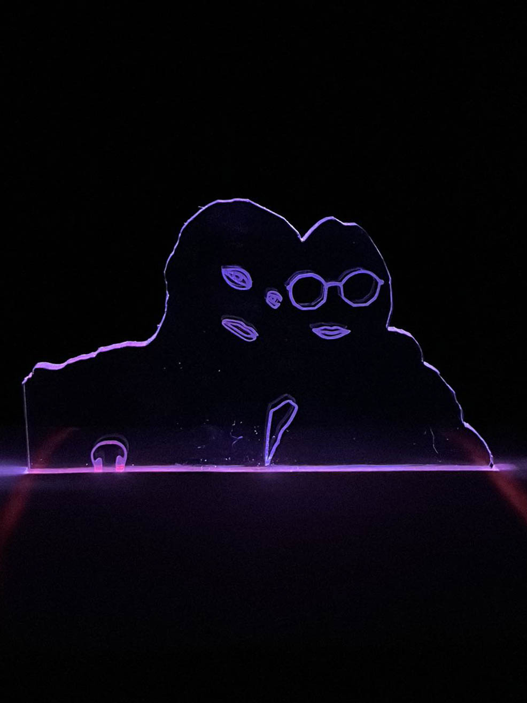
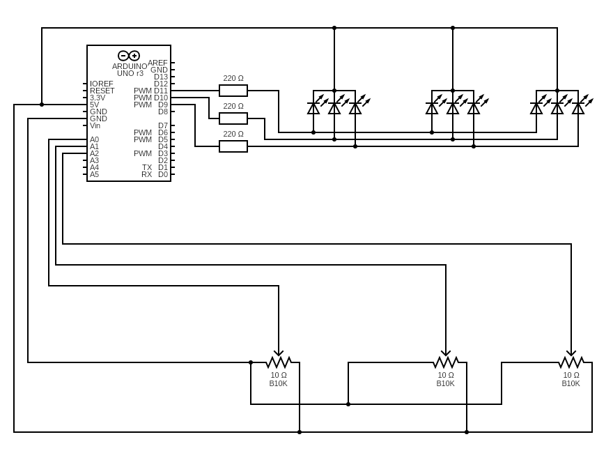

# RGB Case

Ever wanted to have a cool RGB nightstand lamp? This is your project! We will be making a hue shifting lamp combined with plexiglass and a wooden frame to hold our electronics. Below, you can find some pictures of the finished product!

This project only describes the electric circuit. You can use this in whatever other RGB lamp projects you need. The wooden frame and plexiglass are just what I need from this project. Feel free to spice things up.

### Images

    
    
    
    

### Specifications

- Arduino Uno R3
- 3 RGB LEDs (4 pins)
- 3 10K Potentiometer (B10K)
- 1 Breadboard

#### Electric Circuit

[Website used to design the circuit.](https://www.circuit-diagram.org/editor/)

### Usage

This script is free to use. You just have to change the pins to your setup and let the sketch do the rest.
